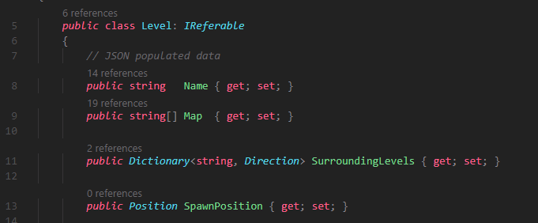

# The Code of SmallAdventure

I really enjoyed the idea of an Adventure game when the project was first assigned, and I knew I wanted to make a 2D version of it almost immedatly
  

# Inspiration

What I first thought of when I was thinking about making a 2d text adventure game was Dwarf Fortress adventure mode. This allows players to walk around and become a hero (or more likely die) in a with 100s of years of generated lore each game. 

This gave me a basic outline of what I wanted:

- The ability to walk around and interact with most objects in the world 

- New content to be easily added to the game so different worlds could be explored easily

- I wanted to turn the game in on time with a good grade

# How It Works

## The World Class

Everything that exists in the game is contained in the World class.

- Levels are stored in the world as a Dictionary of Level Names to Level Data
- Items are stored the same way, Item names to Item data
- Actors as well, Names to Data

The reason the Items, Levels, and Actors are stored this way, instead of say a List, is simply convince. It was easier to say:

`World.Levels["The Crossroads"]`

instead of keeping track of a whole Level object every time you need to do something with a level, for example.

## The Actor Class

- Movement can result in moving to a new level
- What happens if two levels are different sizes

- funny story about why HP has a default value

## The Level Class

- why System.Text.Json makes me angry sometimes

## The Item Class